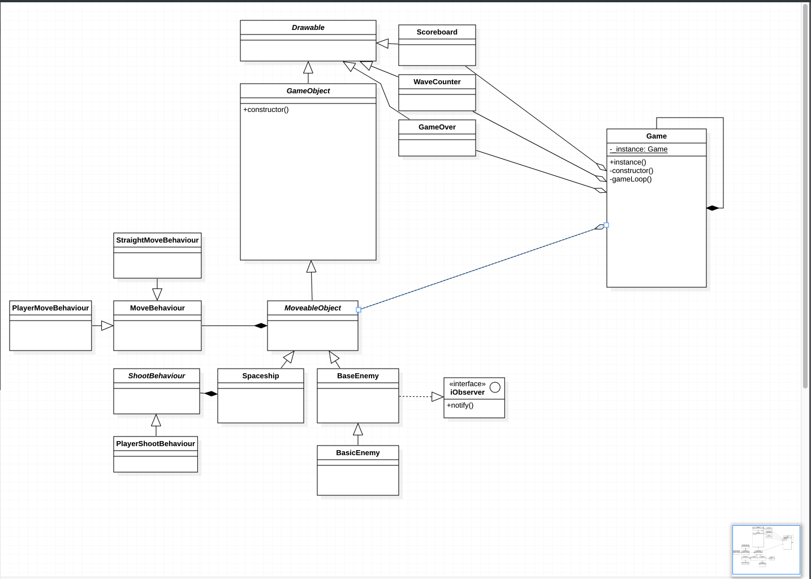

# PRG08 Applying Design Patterns

This is a school assigment. The task is to use OOP practices in Typescript to create a game.

Play it at http://woutervandermeulen.nl/typescript_game


# Development

For local development you should start the typescript compiler and the node app. This could probably be improved with a gulp script.

```
tsc --watch

node app.js
```


# Assignments

Week 4: [Pull request](https://github.com/mkMolendijk/PRG08-Typescript-Game/pull/1)

## UML



Not done yet


## Singleton

The game class is build as a Singleton to prevent multiple instances of the game.

```typescript
// It's initalized here.
window.addEventListener("load", function () {
  Game.instance();
});


// And is structured like so
class Game {
  private static _instance: Game;

  public static instance(): Game {
    if (!this._instance) {
      this._instance = new Game();
    }
    return this._instance;
  }
}
```

## Polymorphism

This game employs serveral Polymorfic relations.

The first one being Drawable. A class that defines some rendering logic.

```typescript
abstract class Drawable {
  public abstract update(): void

  public draw(): void {
    ...
  }

  public remove(): void {
    ...
  }
}
```

Then there is the GameObject. A Drawable object that is meant to be part of the game in some way.
This class adds collision and bounds control. Which don't have to be used, but are available.

```typescript
abstract class GameObject extends Drawable {

  public outOfBounds(){
    ...
  }

  protected keepFromOutOfBounds(): void {
    ...
  }

  public hasCollision(obj: GameObject): boolean {
    ...
  }
  public hasCollisions(array: Array<GameObject>, func: Function): void {
    ...
  }
}
```

## Strategy pattern

To keep in the spirit of the GameObject. The strategy is implemented one step further.

```typescript
// We define a another abstract class which defines the movebehaviours
abstract class MoveableObject extends GameObject {
  private _moveBehaviour!: MoveBehaviour;

  get moveBehaviour(): MoveBehaviour { return this._moveBehaviour }
  set moveBehaviour(behaviour: MoveBehaviour) { this._moveBehaviour = behaviour }

  public move(): void {
    this._moveBehaviour.move();
  }
}

// Then we implement it in the player class. Which also adds another Strategy for shooting
class Player extends MoveableObject {
    private _shootBehaviour!: ShootBehaviour;

    get shootBehaviour(): ShootBehaviour { return this._shootBehaviour }
    set shootBehaviour(behaviour: ShootBehaviour) { this._shootBehaviour = behaviour }

    constructor() {
        ...
        this.moveBehaviour = new PlayertMoveBehaviour(this);
        this.shootBehaviour = new PlayertShootBehaviour(this);
    }
    public update() {
        this.move();
    }
}
```

## Observers

Observers are implemented in the AbstractEnemy.

Every enemy is observing each other. And they will react when you destroy another one of them.
In this game basic enemies will speed up when you kill another in their sqaudron.
The `notify()` method is abstract. So implementation can differ per enemy type.

```typescript
class AbstractEnemy
  public abstract notify(): void;
  ...
  public hit(): void {
    Game.instance().enemies.forEach(e => {
      e.notify();
    });
    this.remove()
  }
}


class BasicEnemy extends AbstractEnemy {
  ...
  public notify(): void {
    this.moveBehaviour.xSpeed += -1;
  }
}
```

## Basic Factory

As an extra I've included a basic Factory pattern which spawns new enemies when there are no enemies left.
In this game the amount of enemies will increase with each wave.

```typescript

class Game {
  private function gameLoop(){
    ...
    if (this.enemies.length <= 0) {
      this._wave += 1;
      EnemyFactory.create((5 + this._wave), window.innerWidth - 50, 20, 180);
    }
    ...
  }
}

class EnemyFactory {
  static create(amount: number, x: number, minY: number, maxY: number): void {
    for (let index = 0; index <= amount; index++) {
      let y_pos = Math.floor(Math.random() * (maxY - minY + 1)) + minY;

      // new BasicEnemy(x, y_pos);
      Game.instance().enemies.push(new BasicEnemy(x, y_pos));
    }
  }
}
```